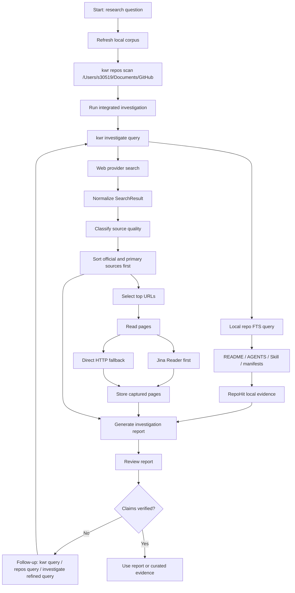

# Research Flow

Use this as the operator flow for high-signal web research.

## Flowchart



## Practical Commands

Refresh the local corpus:

```sh
kwr repos scan /Users/s30519/Documents/GitHub --archive ~/.kwr/research.sqlite --max-repos 200 --max-files-per-repo 40
```

Run a full investigation:

```sh
kwr investigate "OpenAI Agents SDK handoffs" \
  --archive ~/.kwr/research.sqlite \
  --web-limit 8 \
  --repo-limit 6 \
  --read-top 3 \
  --out reports/openai-agents-handoffs.md
```

Search captured pages later:

```sh
kwr query "handoffs" --archive ~/.kwr/research.sqlite
```

Search local repository evidence later:

```sh
kwr repos query "handoff agent" --archive ~/.kwr/research.sqlite
```

## Decision Rules

- Use `kwr investigate` for new research questions.
- Use `kwr collect` when you already know the web query and only need page capture.
- Use `kwr brief` when you want a lighter report without page capture.
- Use `kwr query` when the answer may already be in captured pages.
- Use `kwr repos query` when the answer may already be in local GitHub repositories.

## Evidence Checklist

Before relying on a result:

- official or primary source appears in Best Web Candidates
- local repository evidence agrees with the adopted approach or is marked as unrelated
- captured page exists for any important web claim
- archive path is recorded
- report was generated after the latest relevant corpus scan

